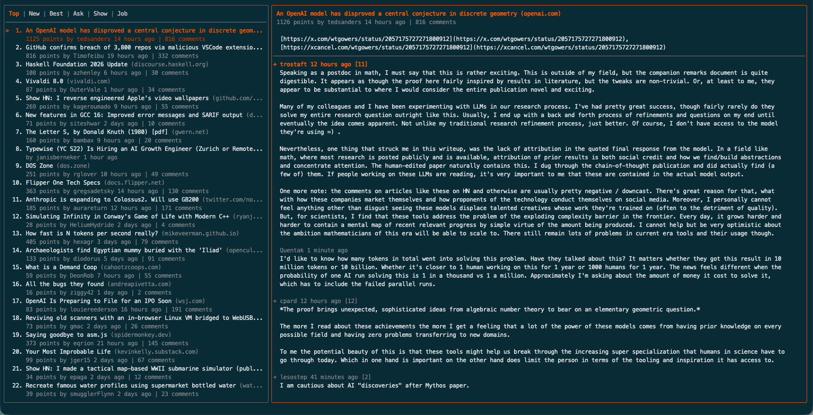

# 🚀 THN — Hacker News in your Terminal

`thn` is a beautiful, keyboard-driven Terminal UI (TUI) client for Hacker News. Built in Go using the **Charm Bubble Tea** (v2) ecosystem, it offers a fast, layout-responsive, and visually pleasing experience for reading stories and comments straight from your terminal.



---

## ✨ Features

- **Multi-Pane Layout**: Browse stories on the left and read comments on the right.
- **Full-Screen Reader**: Maximize the comments panel for focused reading.
- **HN Categories**: Easy tab navigation between **Top**, **New**, **Best**, **Ask**, **Show**, and **Job** stories.
- **Smart Comments Tree**: 
  - Expand/collapse nested comments.
  - Asynchronous lazy-loading of deep reply branches.
  - Quick keyboard jumps between parents and sibling replies.
- **Browser Integration**: Instantly open stories, HN threads, or even specific comment threads in your default browser.
- **Beautiful Styles**: Curated CLI styling built with **Lip Gloss**, adapting beautifully to your terminal window sizes.

---

## ⌨️ Keybindings

`thn` is designed to be fully navigable without touching your mouse.

### Global & Categories
| Key | Action |
|---|---|
| `Tab` | Next Hacker News category |
| `Shift + Tab` | Previous Hacker News category |
| `r` | Refresh stories / comments |
| `q` / `Ctrl + C` | Quit |

### Story List Navigation (Left Pane)
| Key | Action |
|---|---|
| `j` / `Down` | Move down to next story |
| `k` / `Up` | Move up to previous story |
| `h` / `Left` | Previous page of stories |
| `l` / `Right` | Next page of stories |
| `g` / `Home` | Go to first story |
| `G` / `End` | Go to last story |
| `Enter` / `Space` | Open comments panel for selected story |
| `O` | Open story URL in browser |
| `o` | Open Hacker News story thread in browser |

### Comments Navigation (Right Pane)
| Key | Action |
|---|---|
| `j` / `Down` | Move down to next visible comment |
| `k` / `Up` | Move up to previous visible comment |
| `Enter` / `Space` | Expand / collapse sub-comments |
| `h` / `Left` | Go to parent comment |
| `p` | Go to previous sibling comment |
| `n` | Go to next sibling comment |
| `g` / `Home` | Jump to first comment |
| `G` / `End` | Jump to last comment |
| `Ctrl + Enter` | Toggle full-screen reading for comments |
| `ctrl + o` | Open selected comment in browser |
| `Esc` | Close comments panel and return focus to stories |

---

## 🛠️ Installation & Running

### Requirements
- **Go** (1.21 or later)

### Build & Run
Clone the repository and build the executable:

```bash
# Clone the repository
git clone https://github.com/lakerszhy/thn.git
cd thn

# Run directly
go run main.go
```

Alternatively, build the binary:

```bash
# Build binary
go build -o thn main.go

# Run the binary
./thn
```
